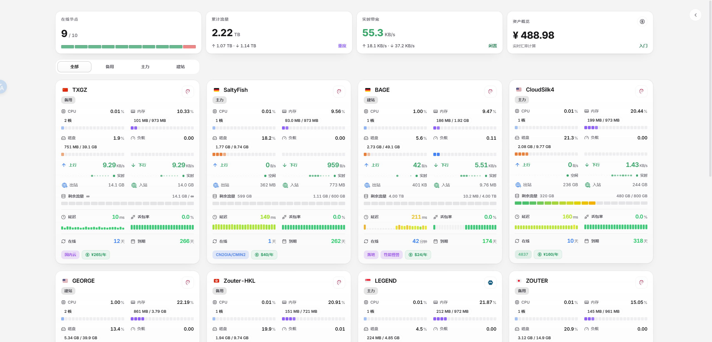
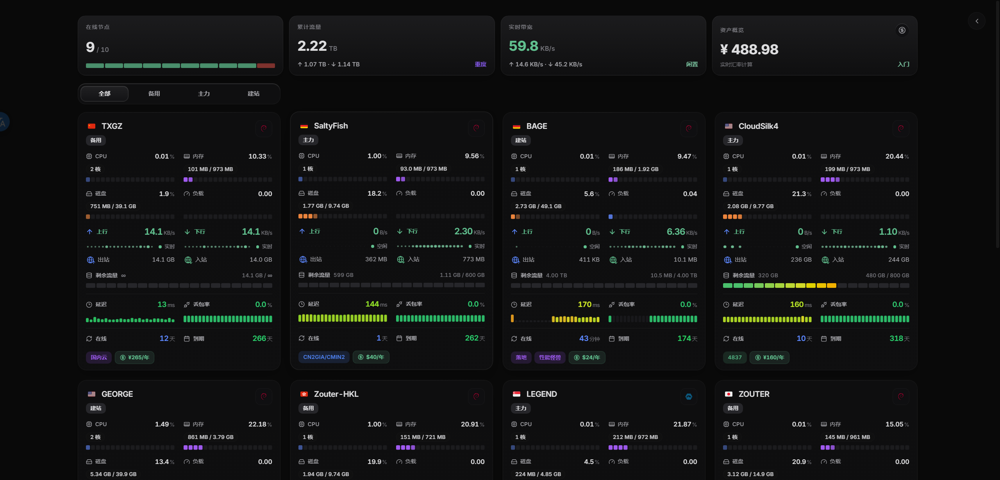
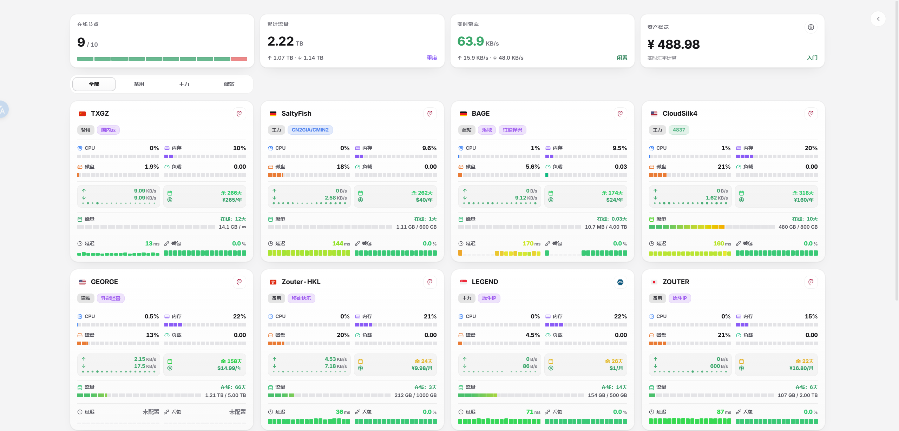
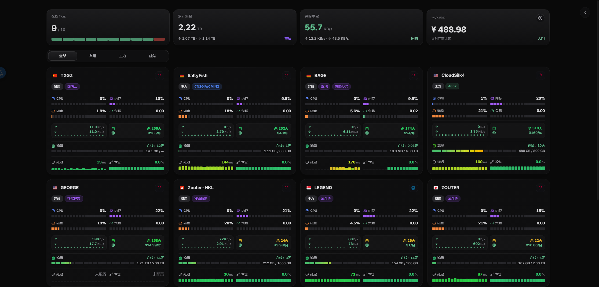
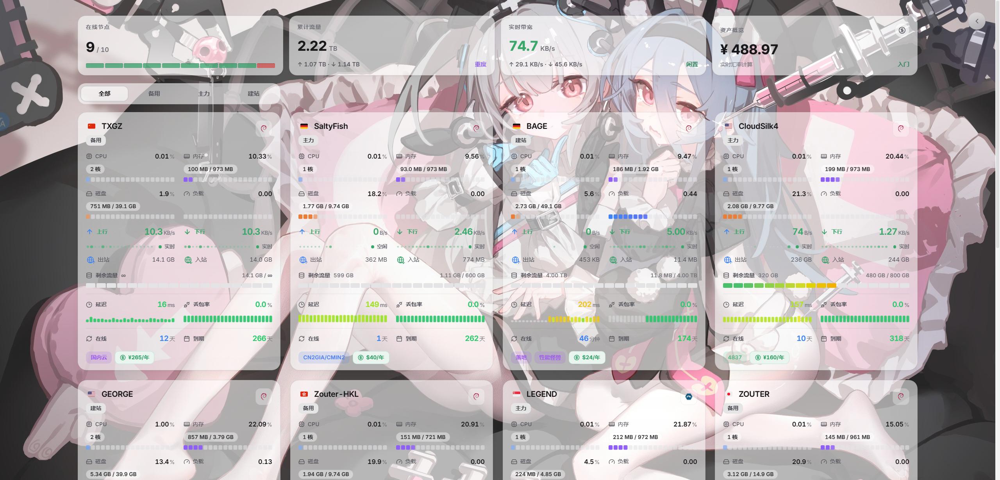
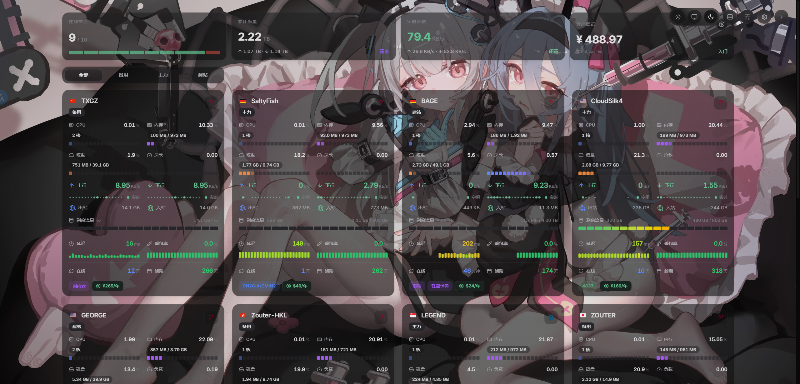

# Komari-Theme-SAO

> ⚠️ **声明：本项目为个人纯自用 / 定制二次开发分支。**  
> 如果您是在寻找或探索适用于 Komari 的主题，**强烈推荐前往并 Star 原作者的上游项目**：
> - 推荐上游分支：[shanyang242/Komari-Theme-LuminaPlus](https://github.com/shanyang242/Komari-Theme-LuminaPlus)
> - 推荐初代主题：[stqfdyr/komari-theme-Lumina](https://github.com/stqfdyr/komari-theme-Lumina)

---

## 🌲 项目渊源与族谱

本项目代码演进脉络如下：

```text
Komari 探针监控服务端 (komari-monitor/komari)
  └── komari-theme-Lumina (作者: @stqfdyr)
        └── Komari-Theme-LuminaPlus (作者: @shanyang242 / @shark)
              └── Komari-Theme-SAO (当前仓库: 个人自用定制分支)
```

1. **[Komari](https://github.com/komari-monitor/komari)**：底层探针监控服务端。
2. **[komari-theme-Lumina](https://github.com/stqfdyr/komari-theme-Lumina)**：原作者 `@stqfdyr` 设计并开源的优雅主题。
3. **[Komari-Theme-LuminaPlus](https://github.com/shanyang242/Komari-Theme-LuminaPlus)**：`@shanyang242` 基于 Lumina 深度重构的增强分支，新增了背景图/视频、透明度调节、首页总览文字评级、Ping/负载图表等诸多实用特性。
4. **[Komari-Theme-SAO](https://github.com/WAOR/Komari-Theme-SAO)**：本项目，基于 LuminaPlus 进行的个人二次开发与针对性优化分支。

---

## 🛠️ 本分支定制与优化内容

- **极简立体仪表盘设计**：
  - **毛玻璃顶部导航栏**：采用高质感磨砂玻璃材质与自适应品牌标题，布局清晰紧凑。
  - **监控总览双栏卡片**：
    - **核心指标区**：集成 6 项关键运维指标卡片（实时速率、全站流量、在线比例、临期提醒、资产总值等），支持悬浮立体微投影与平滑悬停动效。
    - **集群状态区**：内置分段式服务器在线率状态指示格与全站实时网络吞吐动态平滑波形图。
  - **灵动流光问候语**：首屏顺滑流光入场，搭配轻量呼吸流光动效，支持按不同时段智能切换贴心问候。
- **全新护眼与极简深色体验**：
  - **浅色护眼模式**：采用分层护眼浅灰底色与纯白立体悬浮卡片，告别强白光眩目感。
  - **深色极简碳黑模式**：采用纯粹中性碳黑调色体系，无杂色泛蓝，暗色环境观感更加深邃沉浸。
- **shadcn/ui 风格临期提醒悬浮卡片**：
  - 采用轻量磨砂半透悬浮卡片（HoverCard），鼠标悬停即开即停，操作自然丝滑。
  - 智能 7 天临期预警机制，与全站状态保持精确一致。
- **服务器价格与资产隐私保护机制**：
  - **访客价格公开设置**：在主题管理页面「花费」中可配置是否向访客公开价格。未登录状态下默认隐藏服务器价格标签及资产敏感数据。
  - **一键快捷显隐开关**：已登录管理员可在右上角悬浮工具栏通过眼睛图标一键切换显示/隐藏价格与资产，方便日常截图与分享。
- **Radix UI Colors 官方色彩全量支持**：
  - 完整对齐并支持 Radix 官方全套 30 种色彩体系，为浅色与深色模式分别调校了专属色阶与对比度。
- **标签分隔符多格式兼容**：
  - 兼容中英文分号与逗号（`;`、`,`、`；`、`，`），防止服务器标签误粘连。
- **CI/CD 自动化构建**：
  - 配置 GitHub Actions 自动编译与 Release 打包流，发布版本时一键生成主题安装包。

---

## 效果预览

<p align="center">
  
</p>

### 首页总览与节点卡片

首页总览包含文字评级，节点卡片同步优化流量额度、在线时长与布局密度；支持背景图、桌面视频与卡片透明度调节。

<p align="center">
  
</p>

<p align="center">
  
</p>

<p align="center">
  
</p>

<p align="center">
  
</p>

### 透明背景与视频背景

背景图、桌面视频与卡片透明度可在主题管理中配置，支持大卡片、小卡片和移动端布局。

<p align="center">
  
</p>

<p align="center">
  
</p>

---

## 💻 本地开发与预览

无需连接真实 Komari 后端也可以预览完整交互与所有色彩标签：

```bash
# 启动本地开发服务器
npm run dev

# 浏览器访问（包含丰富的 Radix 色彩 Mock 节点数据）
http://localhost:5173/?mock=1
```

---

## 💖 致谢

- 特别感谢 **[stqfdyr/komari-theme-Lumina](https://github.com/stqfdyr/komari-theme-Lumina)** 开源了初代 Lumina 主题。
- 特别感谢 **[shanyang242/Komari-Theme-LuminaPlus](https://github.com/shanyang242/Komari-Theme-LuminaPlus)** 的优秀工作与丰富功能扩展。
- 特别感谢 **[Montia37/komari-theme-purcarte](https://github.com/Montia37/komari-theme-purcarte)** 提供视频背景的设计思路与素材。
- 特别感谢 **[Komari](https://github.com/komari-monitor/komari)** 探针监控项目及社区开发者。

---

## 🔗 参考链接

- [Komari 官方仓库](https://github.com/komari-monitor/komari)
- [Komari 主题开发文档](https://komari-document.pages.dev/)
- [komari-theme-Lumina](https://github.com/stqfdyr/komari-theme-Lumina)
- [Komari-Theme-LuminaPlus](https://github.com/shanyang242/Komari-Theme-LuminaPlus)
- [Radix UI Colors 文档](https://www.radix-ui.com/themes/docs/theme/color)
