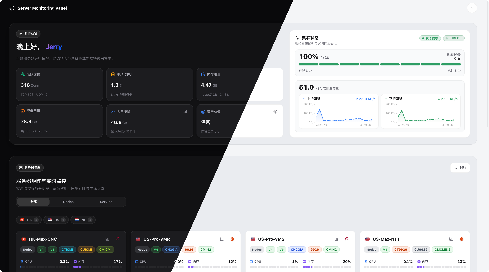
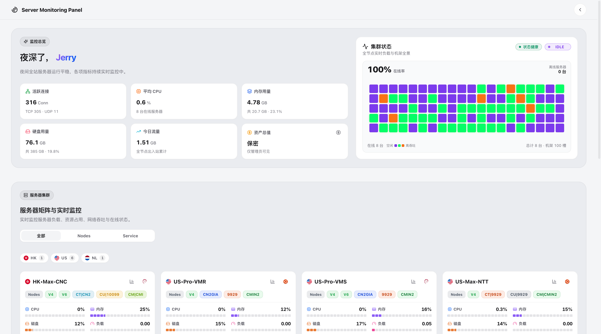
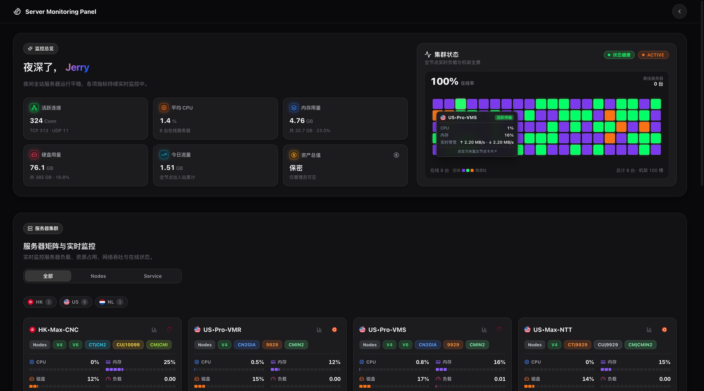
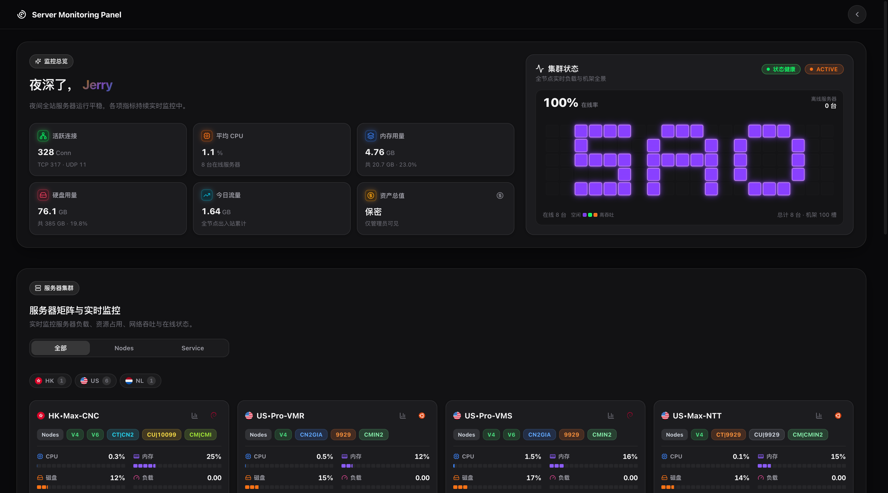
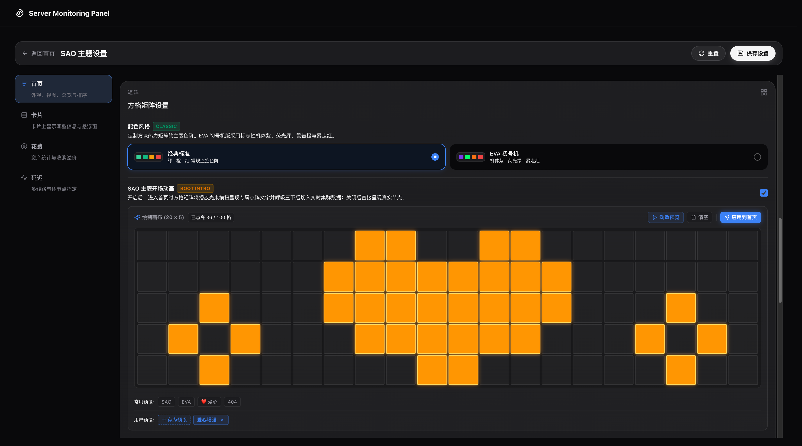
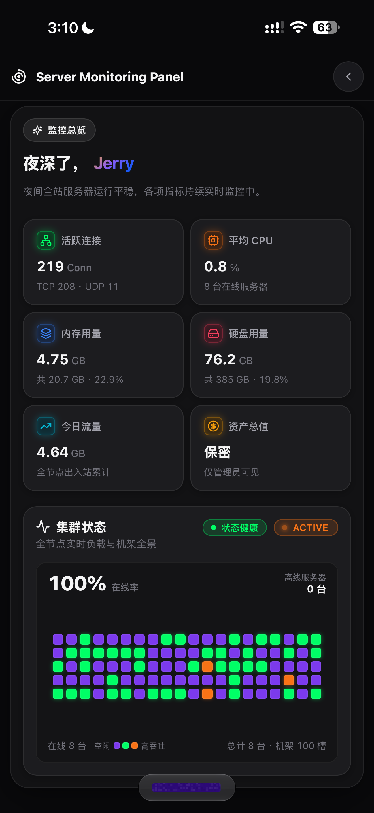
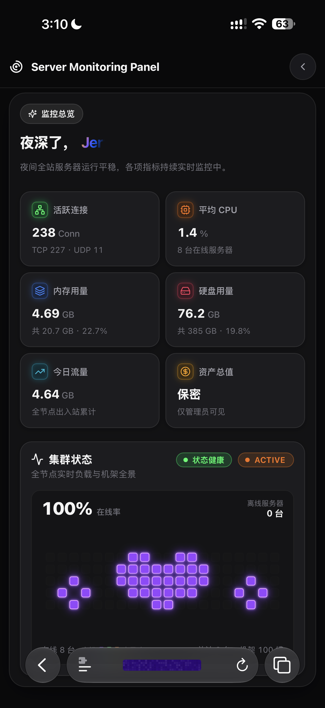
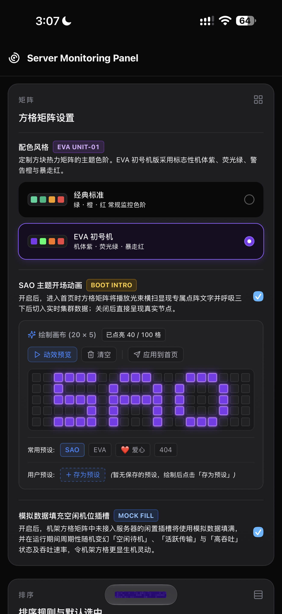

<p align="center">
  <strong>面向多种探针服务端的 SAO 系列仪表盘主题</strong>
</p>

<p align="center">
  <a href="https://github.com/WAOR/Komari-Theme-SAO">🌸 Komari 端</a> &nbsp;|&nbsp; 
  <a href="https://github.com/WAOR/CFSM-SAO">☁️ CFSM 端</a> &nbsp;|&nbsp; 
  <a href="https://github.com/WAOR/Monitor-SAO">⚡ 极简探针端</a>
</p>

<p align="center">
  
  
  
</p>

<p align="center">
  
</p>

---

## ⚡ 核心功能与工业美学

### 🚀 极致性能与首屏架构
* **数据并行预取**：HTML `<head>` 阶段提前并行请求，彻底消除单页应用串行阻塞；
* **立体骨架秒级占位**：真实数据抵达前渲染同构呼吸骨架屏，拒绝空白等待；
* **按需分包异步加载**：轻量核心骨架，重型图表库按需懒加载，严格控制首屏体积。

---

### 🎮 集群看板双形态自由切换
支持在主题管理中根据集群规模与偏好自由切换看板呈现形态：

#### 🔲 「方格矩阵」大集群全景模式
专为大规模节点打造的高密度俯瞰热力看板：
* **20 列整屏机架热力**：突破单行进度条限制，单屏容纳上百台机器，溢出无缝垂直滚动；
* **实时吞吐动态梯级变色**：单机方格根据实时吞吐（空闲待机 / 活跃传输 / 高吞吐）呈现动态色彩梯级与呼吸流光；
* **开屏激光扫光动效**：进入站点时激光束横扫点亮点阵专属文字，呼吸聚能后平滑切入实时集群数据；
* **内置微型点阵画板**：配备 20×5 点阵 DIY 画板，支持自定义开场动画图案跨设备漫游同步，并预置「经典标准」与「EVA 初号机」等系统方案；
* **闲置机位灵动呼吸填充**：可选开启闲置插槽模拟数据，周期性随机变幻速率，保持整屏矩阵饱满生动。

#### 〰️ 「经典波形」健康看板模式
专为精细化网络吞吐波动观察打造：
* **双轨原生 SVG 吞吐波形**：轻量级贝塞尔实时曲线，内置自适应标尺算法，流畅呈现瞬时网络脉冲；
* **分段式在线健康指示格**：单机一格映射存活状态，全站在线率一目了然；
* **状态呼吸胶囊与带宽评级**：根据全站瞬时吞吐动态映射等级徽章与联动呼吸流光。

---

### 🎨 运维细节与设计质感
* **中性碳黑与护眼浅灰**：纯正中性深色底色，消除泛蓝疲劳感；浅色模式降低视觉眩光；
* **资产数据一键防窥**：敏感节点费用与资产总值默认隐藏，支持顶栏快捷键一键安全截图分享；
* **iOS 灵动岛全景融入**：安全区色彩自然漫延至状态栏与灵动岛背后，彻底消除顶部色彩断层。

---

### 🏷️ 节点高级彩色标签定制 (Radix Colors)
各探针原生支持的色彩非常有限。SAO 主题在前端层面全量引入并支持了完整的 [Radix UI Colors](https://www.radix-ui.com/themes/docs/theme/color) 调色板，可在后台为线路或节点自由指定丰富的高定专属色彩：

* **🌸 Komari 端指定语法**：在后台节点标签中填写 `标签名<颜色>`，多标签用分号 `;` 分隔：
  ```text
  CN2GIA<Blue>;9929<Tomato>;CMIN2<Grass>;精品网<Amber>
  ```
* **☁️ CFSM 端指定语法**：在后台节点备注中填写 `标签名-颜色`，多标签用英文逗号 `,` 分隔：
  ```text
  CN2GIA-Blue,9929-Tomato,CMIN2-Grass,精品网-Amber
  ```
* **⚡ 极简探针端说明**：因当前极简探针官方服务端尚未提供节点标签（Tags）字段，该功能暂处于冻结等待期，待服务端后续开放后主题将第一时间跟进适配。
* **支持的色彩池**：全量支持 Radix UI 规范色彩名（不区分大小写）：
  > `Tomato` · `Red` · `Ruby` · `Crimson` · `Pink` · `Plum` · `Purple` · `Violet` · `Iris` · `Indigo` · `Blue` · `Cyan` · `Teal` · `Jade` · `Green` · `Grass` · `Lime` · `Mint` · `Sky` · `Amber` · `Yellow` · `Orange` · `Gold` · `Bronze` 等。若未手动指定颜色，主题将基于关键词自动匹配适宜色系。

---

## 📸 视觉效果预览

### 🖥️ 桌面端集群全景 (Desktop)
| 浅色模式（EVA 初号机配色） | 深色模式（EVA 初号机配色） |
| :---: | :---: |
|  |  |
| **开屏激光扫光与点阵文字** | **主题管理：微型点阵画板与矩阵设置** |
|  |  |

### 📱 移动端窄屏精细适配 (Mobile)
| 移动端深色矩阵全貌 | 移动端开屏点阵动效 | 移动端主题管理与点阵画板 |
| :---: | :---: | :---: |
|  |  |  |

---

## 🧩 多端特性对比矩阵

| 核心特性 / 维度 | 🌸 Komari 端 | ☁️ CFSM 端 | ⚡ 极简探针端 |
| :--- | :---: | :---: | :---: |
| **方格矩阵全景看板** | ✅ 支持 | ✅ 支持 | ✅ 支持 |
| **开屏扫光 & 点阵画板** | ✅ 支持 | ✅ 支持 | ✅ 支持 |
| **经典波形健康看板** | ✅ 支持 | ✅ 支持 | ✅ 支持 |
| **深浅双色体系** | ✅ 中性碳黑 | ✅ 中性碳黑 | ✅ 中性碳黑 |
| **资产与费用隐蔽保护** | ✅ 支持 | ✅ 支持 | ✅ 支持 |
| **节点标签系统** | 🏷️ 支持指定 Radix 色彩 (`标签<颜色>`) | 🏷️ 支持指定 Radix 色彩 (`标签-颜色`) | ⏳ 待后端开放接口 |
| **部署方式** | 主题商店搜索一键安装 / 上传 ZIP | 主题商店搜索一键启用 / 仓库地址安装 | 填入仓库地址一键安装 / 上传压缩包 |
| **项目地址** | [Komari-Theme-SAO](https://github.com/WAOR/Komari-Theme-SAO) | [CFSM-SAO](https://github.com/WAOR/CFSM-SAO) | [Monitor-SAO](https://github.com/WAOR/Monitor-SAO) |

---

## 🏷️ 多端版本号规范与维护机制

本项目与 [Komari-Theme-SAO](https://github.com/WAOR/Komari-Theme-SAO) 及 [CFSM-SAO](https://github.com/WAOR/CFSM-SAO) 共同构成 SAO 探针主题家族。为兼顾**跨端核心功能演进的一致性**与**单一探针平台差异化适配的灵活性**，三端主题版本号遵循以下维护约定：

```text
v 主版本 . 次版本 . 修订版本  (例: v1.1.5)
   │        │        │
   │        │        └── 单端专属补丁/小修小补（Patch，各端按需独立递增，不追求一致）
   └────────┴─────────── 跨端核心功能与架构重塑（Major.Minor，三端严格对齐）
```

- **前两位（`X.Y` - 主版本与功能代际）**：代表跨端通用的新功能、重大特性与架构重塑（如方格矩阵看板、双形态切换、点阵画板、深浅色重构等）。三端主题在此层级保持**严格对齐**，确保多平台用户享有相同的功能体验。
- **末位（`Z` - 单端修订补丁）**：代表针对特定探针后端的专属修复、接口兼容与小修小补。
  - 由于各探针服务端（Komari、CFSM、极简探针）的底层技术栈、接口字段与生命周期各不相同，当某一端需要专门优化特定机制时（例如本次 Monitor-SAO 升级至 `v1.1.5` 针对极简探针历史图表做自适应），仅独立递增该端版本号；
  - 其他未受此问题影响的端保持既有稳定版本（如 `v1.1.4`），**不追求末尾修订号刻意对齐**；
  - 当后续下一次跨端重大功能（如 `v1.2.0`）推出时，三端版本号将再次同步汇合。

---

## 🚀 安装与部署

SAO 主题已上架三端各自的主题生态，均提供便捷的一键安装或离线部署支持：

### 🌸 Komari 端
* **方式一：主题商店一键安装（推荐）**  
  进入 Komari 管理后台「主题商店」，搜索 **SAO** 点击安装并启用。
* **方式二：手动上传安装包**  
  前往 [Komari-Theme-SAO Releases](https://github.com/WAOR/Komari-Theme-SAO/releases) 下载主题压缩包，在后台主题管理中上传启用。

### ⚡ 极简探针端 (Monitor-Probe)
* **方式一：仓库地址一键安装（推荐）**  
  在极简探针管理后台「主题设置」页面，复制填入本仓库地址 `https://github.com/WAOR/Monitor-SAO` 即可一键拉取安装。
* **方式二：手动上传安装包**  
  前往 [Monitor-SAO Releases](https://github.com/WAOR/Monitor-SAO/releases) 下载最新打包产物 `theme.tar.gz`，在后台主题设置页面上传启用。

### ☁️ CFSM 端 (CF-Server-Monitor)
* **方式一：主题商店一键启用（推荐）**  
  登录 CFSM 后台前往「主题商店」，搜索 **SAO** 主题点击启用即可。
* **方式二：手动添加仓库地址（锁定特定版本）**  
  在「主题商店」中填入自定义地址安装：
  - 追踪最新发布版：`https://github.com/WAOR/CFSM-SAO/tree/dist`
  - 锁定特定 Commit：`https://github.com/WAOR/CFSM-SAO/tree/<40位CommitSHA>`

---

## 💖 致谢

感谢以下优秀开源项目与社区贡献者的付出：
* **[stqfdyr/komari-theme-Lumina](https://github.com/stqfdyr/komari-theme-Lumina)**：初代优雅主题开创者。
* **[shanyang242/Komari-Theme-LuminaPlus](https://github.com/shanyang242/Komari-Theme-LuminaPlus)**：出色的功能增强分支与架构设计。
* **[volcano-1025/CFSM-Theme-LuminaPlus](https://github.com/volcano-1025/CFSM-Theme-LuminaPlus)**：CFSM 平台的早期移植探索。
* **[guboysky/LuminaPlus](https://github.com/guboysky/LuminaPlus)**：Monitor 探针平台的移植尝试。
* **[Montia37/komari-theme-purcarte](https://github.com/Montia37/komari-theme-purcarte)**：动态背景视频的设计与参考素材。
* **[komari-monitor/komari](https://github.com/komari-monitor/komari)**、**[huilang-me/CF-Server-Monitor](https://github.com/huilang-me/CF-Server-Monitor/)** 与 **[monitor-probe/monitor](https://github.com/monitor-probe/monitor)**：探针监控服务端的作者及社区维护者。

---

## 📄 开源许可证

本项目基于 [MIT License](LICENSE) 开源发布。
